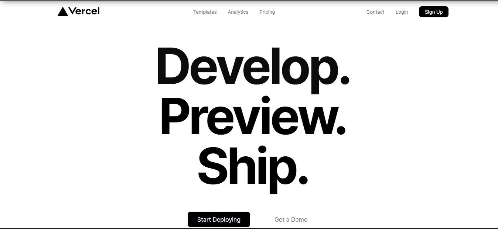

<p align="center">
  
</p>

# Vercel Clone

A static clone of the [Vercel](https://vercel.com) landing page, built with HTML, SCSS and vanilla JavaScript (responsive layout with a mobile menu).

**Live demo:** https://fadyehabamer.github.io/Vercel-Clone/

## Project structure

```
index.html          page markup
css/styles.css      stylesheet loaded by the page (compiled from sass/, with vendor prefixes)
sass/               SCSS sources: styles.scss imports _variables, _extends and _animations
js/main.js          mobile menu toggle, header border on scroll, footer year
images/             logo, illustrations and globe image
```

## Run locally

No build step is needed to view the site. Open `index.html` in a browser, or serve the folder:

```sh
npx serve .
```

## Editing styles

The page loads `css/styles.css`. The SCSS sources compile with [Dart Sass](https://sass-lang.com/dart-sass):

```sh
npx sass --no-source-map sass/styles.scss css/styles.css
```

Note that the committed `css/styles.css` was also run through an autoprefixer, so a plain Sass build drops the `-webkit-`/`-ms-` prefixes. To add the prefixes that current browsers still need, pipe the output through Autoprefixer:

```sh
npx sass --no-source-map sass/styles.scss | npx -p postcss -p postcss-cli -p autoprefixer postcss --use autoprefixer -o css/styles.css
```

Dart Sass currently prints deprecation warnings for `@import` and `lighten()`; they do not affect the output.

## License

[MIT](LICENSE)
